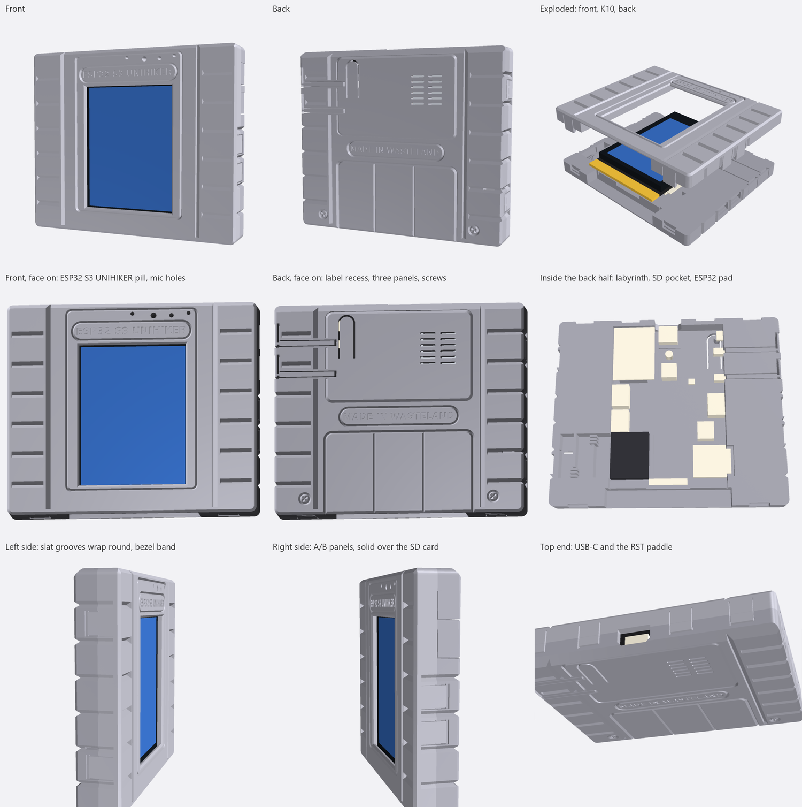

# K10 SNES-style cartridge case

A two-part, snap-together case for the UNIHIKER K10, shaped like an NTSC Super
Nintendo Game Pak: 104 × 88 mm, with the K10 in the middle.

The layout follows the back of a real NTSC shell:

- A smooth centre panel on both faces, with an edge running the full height
  either side.
- Wings of seven slats each, with 2 mm grooves between them like the real
  shell's. On the back, the slat grooves wrap round the edges at full depth and
  carry on up the sides to a plain bezel band.
- Plain rounded corners.
- On the front, the screen is the label.
- On the back, a big label recess sits over a three-panel recess, with a fake
  security screw in each bottom slat.
- Matching nameplate pills: `BAND_TEXT` (UNIHIKER ESP 32) above the screen,
  and `EMBLEM_TEXT` (MADE IN WASTELAND) on the back between the two recesses.

Both halves print face down, so a truly raised centre panel would need
supports. Its edges are stepped grooves instead: a sheer wall on the panel side
and a 45° slope on the wing side, so they read as a step, and they're 2 mm
deep. The recesses on the back are 1.1–1.3 mm deep. The thin lines (the screen
border and the pills) are 1 mm.

Other features:

- The live gold edge connector sits 1.5 mm inside a mouth at the bottom, between
  two solid feet, like an old cart.
- The speaker's sound goes through a labyrinth in the left wing before it
  gets out, to take the edge off the amplifier's hiss. See
  [Speaker hiss](#speaker-hiss-the-labyrinth).

| File | What |
|---|---|
| `K10_SNES_Cart_Front.stl` | Bezel and screen window, with 10 snap tabs. Exported face down. |
| `K10_SNES_Cart_Back.stl` | Floor, wings, ports and the A/B push rods. Exported back face down. |
| `k10_snes_case.py` | Parametric source. `python k10_snes_case.py --check` rebuilds both STLs and runs the fit checks. Needs `manifold3d trimesh numpy matplotlib`. |

Outside size: 104.0 × 87.8 × 16.7 mm. `SIDE_WALL` sets the width; each wing is 25.95 mm.

## Printing

- No supports. Print both parts in the orientation they are saved in.
- PETG works best because the tabs, panels and rods flex. PLA works too, but
  its snap tabs may crack if you open the case often. They bend about 1.7% going
  over their 1 mm hooks.
- 0.2 mm layers, at least 3 walls, so the 0.8–1.0 mm flexures print solid.
- 15–20 % infill is plenty for the solid wings.
- Use a 0.4 mm nozzle. The labyrinth's combs have 0.5 mm slits. After slicing,
  check in the preview that the slits are still open.
- The only flat roofs are short bridges: the lettering, the tab hook pockets,
  the labyrinth's side outlet, and a 0.05 mm flat along the bottom of each
  stepped groove.
- Use light-grey filament for the SNES look.

## Assembly

1. Screen facing up, lay the K10 into the back shell. The gold fingers go into
   the mouth at the bottom.
2. Press the front shell straight down until all ten tabs click:
   - two on each side;
   - four along the top;
   - two on the feet at the bottom.
3. To open it, put a fingernail in the gap under each tab and pull the tab
   outward. The hooks reach 1 mm into the back half, so each tab takes a
   firm pull.

## What you can reach

| Feature | Where |
|---|---|
| USB-C | top end; the opening is 12.6 × 6.8 mm, so a normal cable's plug body fits all the way in |
| A / B | flush panels on the right side. Each panel drives a printed push rod, about 23 mm long, through the wing to its switch. A thin neck lets the panel flex while the rod slides straight. |
| RST | the round-tipped paddle at the top corner of the back; press the tip. A 3 mm post under it reaches the switch |
| microSD | no opening. Put the card in before you close the case. A 3 mm pocket in the right wall (`SD_POCKET`) gives the end of the installed card room |
| Edge connector | recessed 1.5 mm inside the 13 × 55 mm mouth. It's protected, but a standard micro:bit edge socket won't fit into it |
| Gravity P0 / P1, I2C | closed; set `GRAVITY_PORTS = True` to open notches in the side walls |
| Speaker | the big black box on the back, against the left edge. Nothing opens straight onto it: the sound goes through the labyrinth in the left wing. It comes out of one slot in a slat groove on the back and one in the side groove beside it |
| ESP32 module (cooling) | two columns of line vents, six rows each, inside the back label recess over the module's metal can. They go through the pad under the can. The pad stays as a comb, so it still backs the board. Set them with `ESP_VENT_Y` and `ESP_VENT_X` |
| Mics, light sensor, temp/humidity | holes above the screen; the two small mic holes are 1.6 mm across (`MIC_HOLE_R`) |
| Camera | covered (the app doesn't use it) |

## Speaker hiss: the labyrinth

The speaker is the big black box on the back of the board, 17 × 21 mm, against
the left edge next to the gold fingers. Its sound hole is on the side pointing
away from the board. Nothing in the case opens straight onto it,
and the old direct vents over it are gone. The sound has to take this path:

1. It enters the first of three stages. This is a pocket in the left wing,
   open on the side next to the speaker.
2. It gets past each of two baffles only through a comb of four 0.5 mm slits.
   The combs sit at opposite ends, so the sound snakes through the wing.
3. It leaves the last stage by two slots, one in a slat groove on the back and
   one in the side groove beside it. Neither faces the speaker or the first
   stage.

A 1.2 mm dam on the floor closes the far side of the gap under the speaker.
That way the sound goes into the labyrinth instead of into the case.

Stages 2 and 3 sit on a floor raised by 1.2 mm, so the deep slat and edge
grooves under them keep 1 mm of plastic. That leaves the labyrinth about 12%
smaller than the first version, so it may sound a little brighter.

The stages and slits act as an acoustic low-pass filter. They should cut the
top octaves, where the "shhh" lives, and keep the voice and most of the music.
It's a first prototype, sized by estimate rather than measurement:

- Printed slits can't damp the way felt does; that would take gaps under
  about 0.1 mm. Expect some colour or a hump in the upper mids, as well as less
  hiss.
- The lid of the labyrinth is the front half's flat underside, so it only
  seals with all ten tabs clicked.
- It dulls the sound you want as well as the hiss. Hiss made in the amplifier
  is better fixed in the audio path if that's possible.

To test it, record the same sound before and after, at the same volume setting
and from the same spot. Only the back half has to be reprinted to try
different settings:

- `PASSAGE` (5.0): each comb's opening. Narrower gives a duller sound with less
  hiss; wider gives a brighter one.
- `COMB_GAP` (0.5): the slit width. Raise it to 0.6 if your slicer closes the
  slits.
- `OUTLET_RIB`, `OUTLET_X`: which slat groove carries the outlets, and how
  long the back slot is. A shorter slot gives a duller sound.

## Fit: where the numbers come from, and what to check

The XY positions come from DFRobot's straight-on product photos, measured by
pixel against the board's 51.6 × 83 mm outline. The measurements are good to
about ±0.3 mm.

The LCD's black metal frame is easy to miss in the photos: it reaches 2.6 mm
past the glass toward the fingers. The first print's front half landed on it.
The frame is now part of the dummy board that `--check` tests against.

The Z heights come from the reference case in `docs/`: 6.0 mm of room behind
the PCB and 5.7 mm in front of it. `--check` places a dummy K10 in the case and
confirms:

- The board doesn't touch either shell, with a display stack anywhere from
  4.0 mm to 5.6 mm thick. The push rods stop 0.4 mm short of the plungers.
- Pushing in a USB-C plug moves the board 0.5 mm before a rib catches the
  ESP32 module's metal can. The display never takes that load.
- Sideways and toward USB-C, the walls stop the board within 0.35 mm.

If a print needs tuning, these are the parameters to change:

- `FRONT_CLEAR` (5.7): the gap in front of the PCB. If the screen sits deep
  behind the bezel, lower it to your display's height plus 0.3 mm.
- `RST_TOP_Z` (−2.0): the RST post stops 0.5 mm short of this. If RST needs a
  long press, make it more negative.
- `BTN_TIP_X`: how far the A/B plungers stick out. The rod tips sit 0.4 mm off
  them at rest.
- `TONGUE_GAP` (1.0): how far the A/B panels can travel before they bottom out.
- `LIP` (1.0), `TAB_DOWN` (3.5): how far each snap hook reaches in, and how far
  the tabs hang below the seam. A deeper hook grips harder but bends the tab
  more.
- `SIDE_WALL`: the width.
- `PLATEAU_X`, `RIBS`: where the centre panel's edges sit, and how many slats
  each wing has.
- `BACK_LABEL`, `LOWER_PANEL`: the two recesses on the back.
- `SLAT_D`, `SLAT_W` (2.0, 2.6): the slat grooves. `STEP_D` (2.0): the centre
  panel's edges. `LABEL_RECESS_D`, `LOWER_D`: the two recesses on the back.
- `LINE_DEPTH`, `LINE_W` (1.0, 1.2): the thin line grooves (screen border, pills).
- `PASSAGE`, `COMB_GAP`, `OUTLET_RIB`: the speaker labyrinth (see above).
- `BAND_TEXT`, `EMBLEM_TEXT`: the words in the two pills; `""` leaves a pill
  empty. The words are sized to fill their pill (`FRONT_PILL` 50.6 × 7.8 mm,
  `BACK_PILL` 64 × 9 mm). They come out about 3.7 mm tall on the front and
  3.8 mm on the back. The front pill can't get bigger: it already fills the
  space inside the label border, between the screen and the sensor holes. The
  back one fills the gap between the two recesses.

The reference STLs in `docs/` were only used for Z. Their XY doesn't match
the board in the photos:

- The screen window sits about 7 mm too far toward the USB-C end.
- The A-button hole misses the button by about 4 mm.
- The sensor holes don't line up with the mics or the light sensor.
